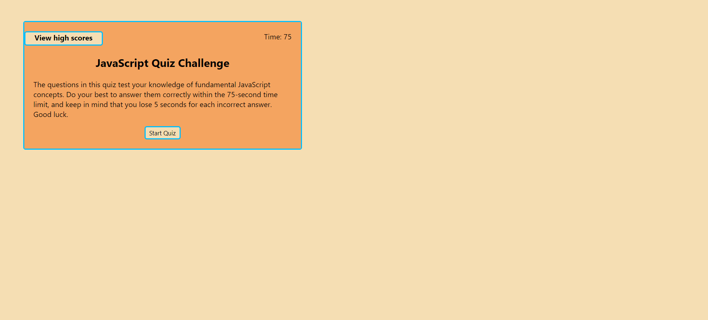

# Challenge 4: Timed JavaScript Quiz

## Description
When you are learning a new skill, it is important to test your knowledge with questions about fundamental concepts. Doing so will help solidify the ideas in your mind and make you more familiar with the topic as a whole. This quiz tests your JavaScript knowledge by asking you 10 questions about methods and concepts you are likely to see and use. After you completed the quiz, you can choose to save your score, which is higher the faster you complete the quiz and the fewer mistakes you make. This project taught me how to use setInterval() and setTimeout(), display only a certain part of the page, and iterate through localStorage to find certain data.

## Table of Contents
- [Description](#description)
- [Installation](#installation)
- [Usage](#usage)
- [Credits](#credits)
- [Contributing](#contributing)
- [Tests](#tests)
- [License](#license)
- [Questions](#questions)

## Installation
No installation is required for this project.

## Usage
Starting from the home page, you are provided with instructions on how to complete the quiz. From there, you can either view high scores, as shown in the header, or start the quiz:

Once you start the quiz, you can view the high scores while the quiz is in progress and it pauses the timer:

If you answer a question correctly, the status will show as `Correct` as shown here:

If you answer a question incorrectly, the status will show as `Incorrect. You have lost 5 seconds.`

Once you have completed the quiz, you will see the results screen:

**If you have completed the quiz:**

**If you have not completed the quiz:**

from there, you can choose whether or not you want to save your latest score. If you choose not to save your score, you will be taken to the high scores page, from which you can go back to the home page. If you choose to save your score, however, you will be presented with a form where you can enter your initials:

However, if you say yes when asked if you want to save your score and then change your mind, you can get back to the home page by clicking `View high scores` in the header.

**Important:** you are required to enter two capital letters for your initials to be accepted. If you do not enter your initials correctly, the page will alert you:

which will then take you to the high scores page:

**Important:** If you choose to save your high score but it is not in the top 10 saved scores, it will not show on the high scores page.

Clicking on the `Clear all high scores from localStorage` button will remove all high scores from localStorage and the high scores page, as shown below:

The deployed application can be found [here](https://gimmekitties711.github.io/challenge_4-timed_javascript_quiz/).

## Credits
Received assistance from AskBCS assistants Daniel and Mia, and from instructor Robbert Wijtman in the *#02-ask-the-class* Slack channel and office hours. The following web resources helped me write the code for this project:

1. [How to write forms](https://www.w3schools.com/html/html_forms.asp)
2. [How to write forms that submit data and move to a different page](https://www.quora.com/How-can-I-create-a-HTML-button-that-submits-and-goes-to-the-next-page)
3. [Stack Overflow: How to center a button in a div](https://stackoverflow.com/questions/15300234/how-can-i-horizontally-center-a-button-element-in-a-div-element)
4. [Stack Overflow: How to use setInterval() to create a countdown](https://stackoverflow.com/questions/31106189/create-a-simple-10-second-countdown)
5. [Validating form input](https://www.w3schools.com/js/js_validation.asp)
6. [Using match() to check if a string matches a regex](https://developer.mozilla.org/en-US/docs/Web/JavaScript/Reference/Global_Objects/String/match)
7. [Regex generator](https://regex-generator.olafneumann.org/?sampleText=2020-03-12T13%3A34%3A56.123Z%20INFO%20%20%5Borg.example.Class%5D%3A%20This%20is%20a%20%23simple%20%23logline%20containing%20a%20%27value%27.&flags=i)
8. [How to find a key that corresponds to a value in localStorage](https://stackoverflow.com/questions/12949723/html5-localstorage-getting-key-from-value)
9. [The includes() method](https://www.w3schools.com/jsref/jsref_includes_array.asp)
10. [The substring() method](https://www.w3schools.com/jsref/jsref_substring.asp)
11. [Stack Overflow: How to sort an array of integers numerically](https://stackoverflow.com/questions/1063007/how-to-sort-an-array-of-integers-correctly)
12. [Stack Overflow: How to retrieve all localStorage values](https://stackoverflow.com/questions/17745292/how-to-retrieve-all-localstorage-items-without-knowing-the-keys-in-advance)
13. [Meaning of DOMContentLoaded](https://developer.mozilla.org/en-US/docs/Web/API/Document/DOMContentLoaded_event)
14. [The localStorage.removeItem() method](https://www.w3schools.com/jsref/met_storage_removeitem.asp)
15. [YouTube: How to handle forms](https://www.youtube.com/watch?v=S944-epyYuI&t=131s)
16. [Stack Overflow: How to remove all children from a parent node](https://stackoverflow.com/questions/3955229/remove-all-child-elements-of-a-dom-node-in-javascript)
17. [How to set style properties in JavaScript](https://www.w3schools.com/jsref/prop_html_style.asp)

## Contributing
This project does not yet have the functionality to delete a specific high score and have the new top 10 scores reloaded with every deletion. If someone could help me implement this feature, that would be greatly appreciated.

## Tests
No tests have been written for this application.

## License
No license is attached to this repository.

## Questions
If you have any questions for me, you can [follow me on GitHub](https://github.com/GimmeKitties711) or email me at eric20wang.wang@gmail.com.
